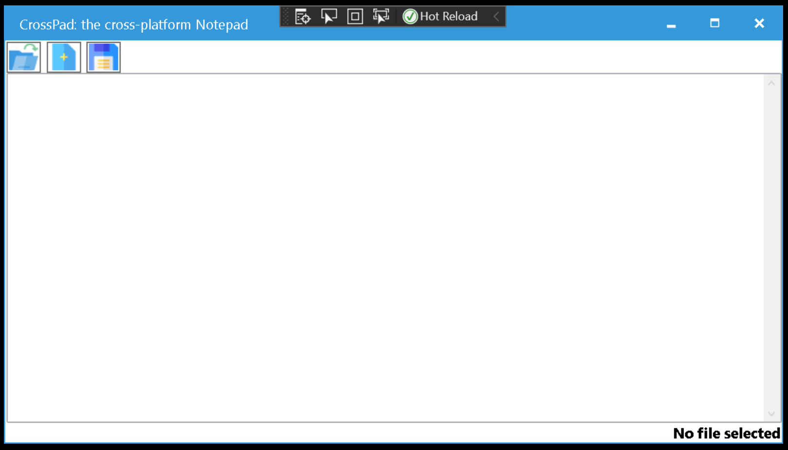
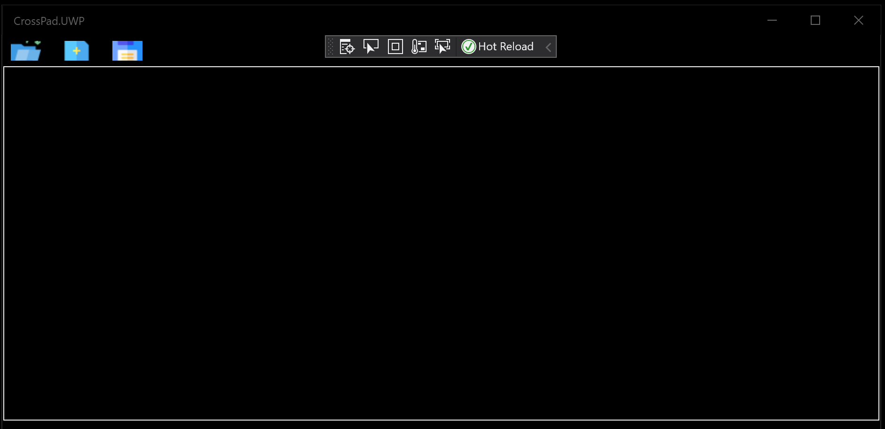
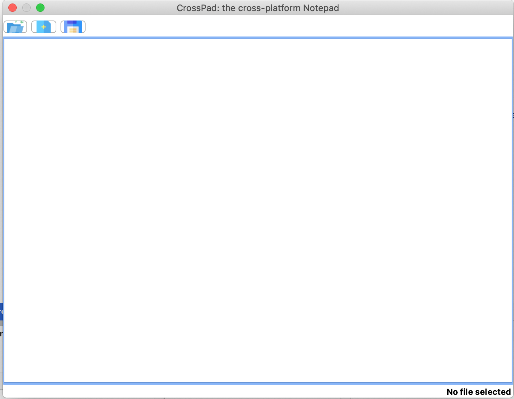

# Xamarin.Forms sample: CrossPad

This is a sample project to show how we can develop a cross platform dekstop application using Xamarin.Forms.

This sample is a fully fonctional, yet simple, *notepad* made for Windows (WPF & UWP) and Mac OS.

# Licence

Wttop is under [MIT license](LICENSE)